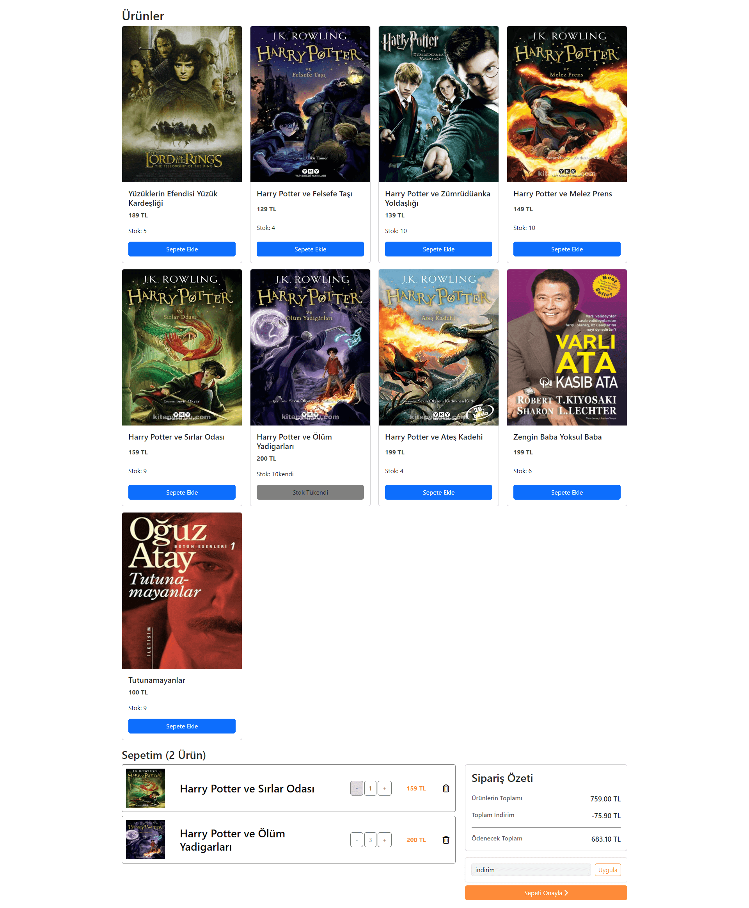

 # Shopping App 
 I wanted to improve myself by making a shopping website example with the React library. I created my data among my files. 
 

 
 ## Features 
 - Cards listing products 
 - Adding, removing and deleting products from the cart 
 - A maximum of products in stock can be added to the cart. If the stock runs out, the add to cart button will be closed. 
 - The product is removed from the basket until only 1 product remains. 
 - View cart summary 
 - Discount coupon application. Type "discount" to apply the discount coupon. 
 
 ## Installation and Usage 
 
 1. Clone the project folder: 
 ` git clone https://github.com/malikemiroglu/Shopping.git ` 
 ` cd project-folder ` 
 
 2. Install the required dependencies: 
 ` Node.js must be installed. ` 
 ` npm install` 
 
 3. Run the project: 
 ` npm run dev` 
 - The project should now be running at http://localhost:3000. 
